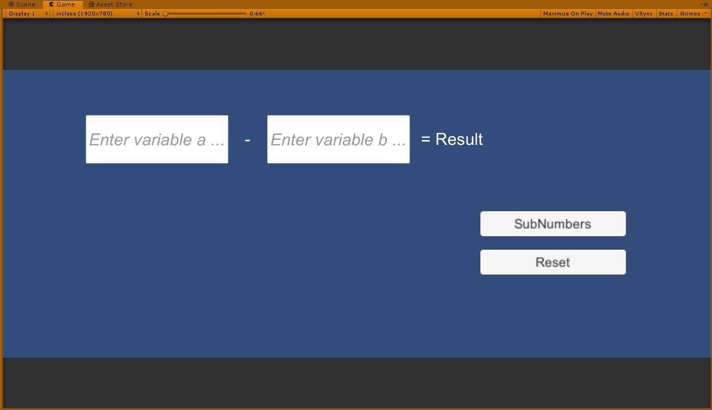
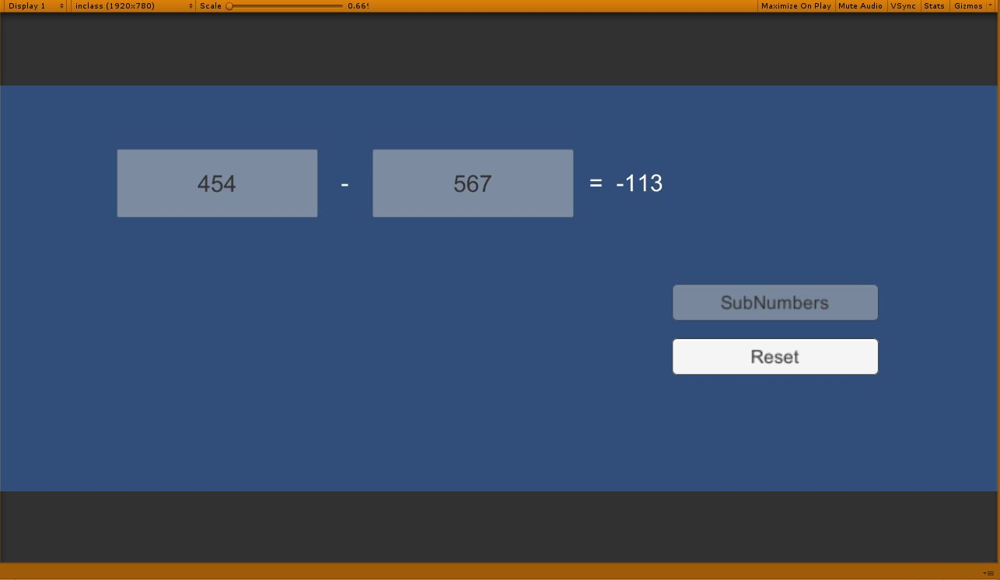

# Unity2019114f1-2D-Template

### Project description: 
A subtracting maschien, that has two input fields where you can insert random numbers and if you click subNumbers it will subtract them. Also you can reset it to insert new numbers.

### Development platform: 
- Windows 10 
- Unity 2019.1.f.14
- Visual Studio 2017

### Target platform: 
WebGL 1920x780

### Screenshots: 

##### Programm Started:

##### Programm Executed:

 

### Necessary setup/execution steps: 
none

### Third party material: 
gitHub Template: https://github.com/3ahmnm-htlsbg/Unity2019114f1-2D-Template

### Project state: 
Finished

### Limitations: 
You can only subtract.

### Lessons Learned: 
- How to create a simple subtracting machine
- How to create a UI and combine it with C# coding

Copyright by e.aussenegg / Eriasu